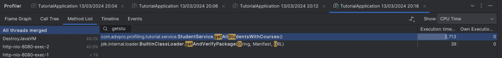

# TUTORIAL 5 ADPRO
### Rafi Ghani Harditama (2206081364)
### Advanced Programming A/VRO

Hasil JMeter sebelum profiling:

all student:

all student name:

highest gpa:

Hasil JMeter setelah profiling:

all student:

all student name:

highest gpa:

Kesimpulan:
Setelah melakukan pengoptimalan performa dan pengujian menggunakan JMeter serta profiling dengan IntelliJ Profiler, terlihat peningkatan signifikan dalam respons program dan waktu eksekusi. Alur program yang semula memakan waktu lama berhasil dioptimalkan, terbukti dengan penurunan drastis dalam waktu eksekusi method-method. Dengan demikian, dapat disimpulkan bahwa optimalisasi tersebut berhasil meningkatkan performa program secara keseluruhan, sekaligus mempercepat respon terhadap permintaan.

## Reflection
1. JMeter digunakan untuk melakukan pengujian performa pada tingkat sistem dengan mensimulasikan banyak pengguna dan berbagai jenis beban kerja. Sementara itu, Intellij Profiler digunakan untuk melakukan profiling yang memberikan analisis runtime dan execution time dari kode secara rinci, membantu dalam mengidentifikasi hot spot dan memahami perilaku program saat runtime. Pengujian menggunakan JMeter fokus pada respons endpoint yang ditentukan, sementara pendekatan profiling lebih mendalam dalam memeriksa proses internal program saat menerima permintaan. Dengan demikian, kombinasi penggunaan JMeter dan profiling dengan Intellij Profiler memberikan pemahaman yang holistik terhadap performa aplikasi dari segi eksternal dan internal.

2. Melalui profiling, saya dapat dengan mudah mengidentifikasi titik lemah dan bottleneck dalam program berdasarkan informasi seperti runtime, penggunaan CPU, atau alokasi memori. Ini memungkinkan saya untuk fokus pada pengoptimalan komponen atau kode yang memperlambat performa, sehingga dapat meningkatkan efisiensi keseluruhan aplikasi tanpa perlu melakukan banyak perubahan pada aspek lainnya.

3. Ya, IntelliJ Profiler terbukti efektif dalam menganalisis performa suatu program dengan mengidentifikasi bottleneck, seperti kasus pada method getAllStudentsWithCourse yang memakan waktu eksekusi yang signifikan. Dengan informasi yang tersedia, pengembang dapat mengoptimalkan method yang paling berpengaruh terhadap performa program secara keseluruhan. Profiler memberikan gambaran yang jelas tentang bagian mana dari kode yang memperlambat kinerja aplikasi, memungkinkan pengembang untuk melakukan penyesuaian yang tepat guna meningkatkan efisiensi secara signifikan.

4. Tantangan utama dalam melakukan pengujian performa dan profiling adalah memahami hasil analisis yang kompleks, yang kadang membuat sulit menentukan faktor utama yang memengaruhi performa program. Untuk mengatasi hal ini, saya memperdalam pemahaman terhadap cara memaknai hasil analisis dan meningkatkan ketelitian dalam menafsirkan data, terutama dalam membandingkan waktu eksekusi sebelum dan setelah optimasi. Hal ini memerlukan keterampilan dan ketelitian yang terus-menerus dalam mempelajari respons kerja aplikasi yang dikembangkan.

5. Penggunaan IntelliJ Profiler sangat menguntungkan bagi saya karena tidak memerlukan aplikasi pihak ketiga tambahan untuk melakukan profiling. Dalam IDE IntelliJ IDEA, fitur profiler yang disediakan memungkinkan saya untuk langsung melihat masalah atau potensi kode yang mempengaruhi performa secara langsung. Dengan demikian, saya dapat menghindari kebutuhan untuk memeriksa dan mengoptimalkan komponen secara manual satu per satu.

6. Hingga saat ini, saya belum menghadapi ketidak konsistenan antara hasil performance testing dan profiling. Namun, jika situasi seperti itu terjadi, saya akan melakukan pemeriksaan terhadap konfigurasi JMeter serta hasil profiling dari IntelliJ Profiler. Saya juga akan menghindari melakukan benchmark performance test saat pertama kali dilakukan, mengingat kemungkinan JVM atau JIT compiler belum berjalan secara optimal. Jika masih terdapat kendala, saya akan mencari solusi melalui internet atau berkonsultasi dengan rekan, asdos, atau dosen untuk menemukan pemecahannya.

7. Setelah menganalisis hasil performance testing dan profiling, langkah awal saya adalah mengidentifikasi titik-titik bottleneck yang paling mempengaruhi penurunan performa secara keseluruhan. Kemudian, saya berusaha mengoptimalkan bagian kode yang telah teridentifikasi sebagai penyebab penurunan performa dengan melakukan refactoring untuk meningkatkan efisiensinya. Setelah melakukan perubahan, saya melakukan performance testing dan profiling kembali untuk memverifikasi apakah performa telah mengalami peningkatan. Untuk memastikan bahwa perubahan yang diterapkan tidak memengaruhi fungsionalitas program, saya melakukan pengujian unit dengan membandingkan output sebelum dan setelah perubahan kode.
